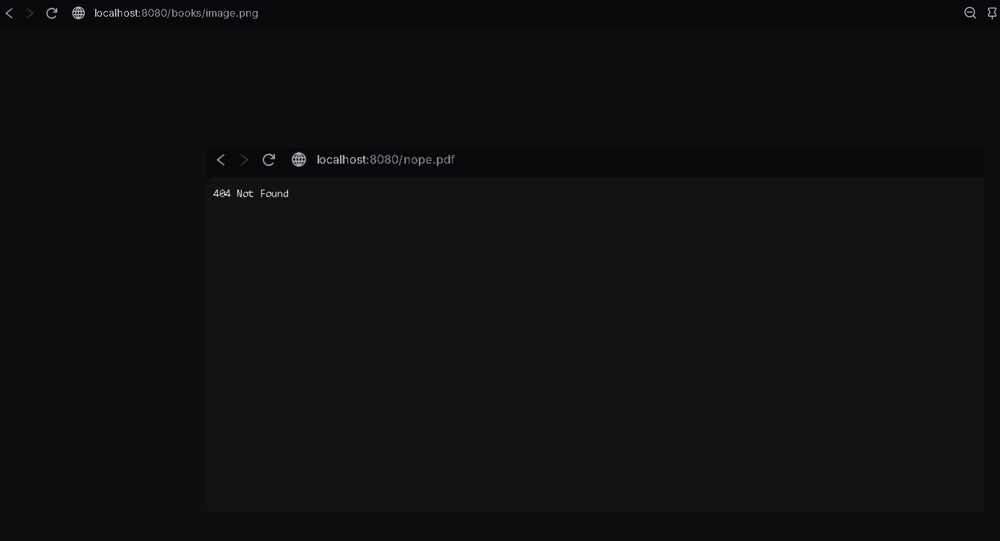
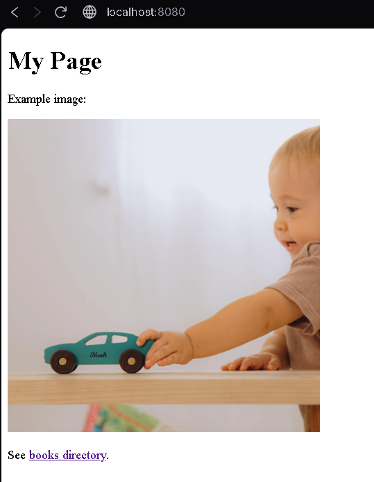
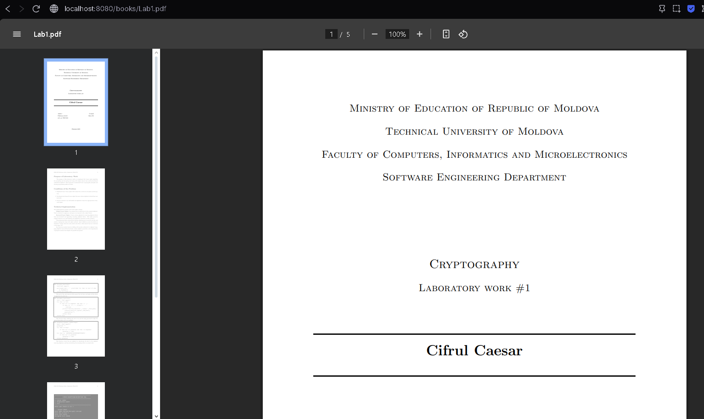
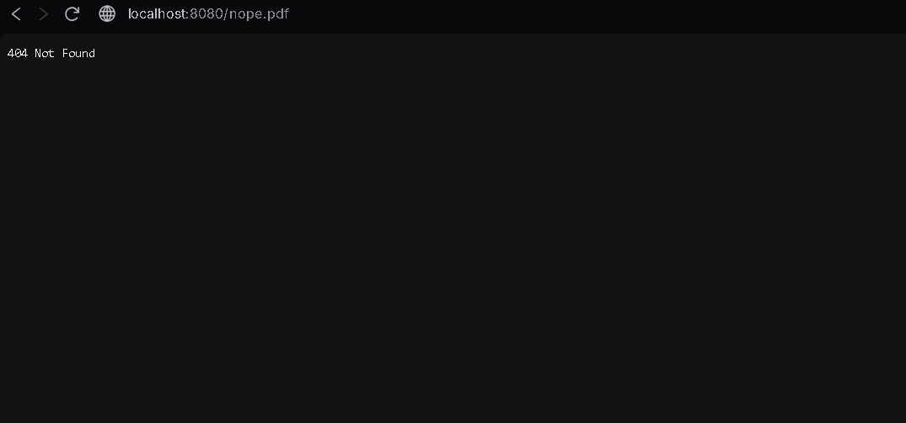
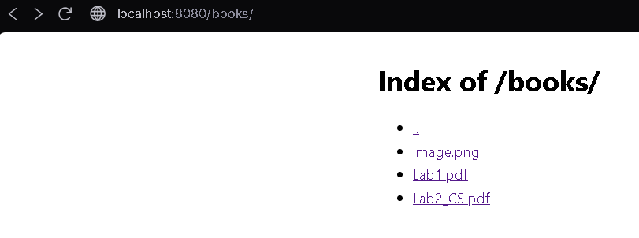
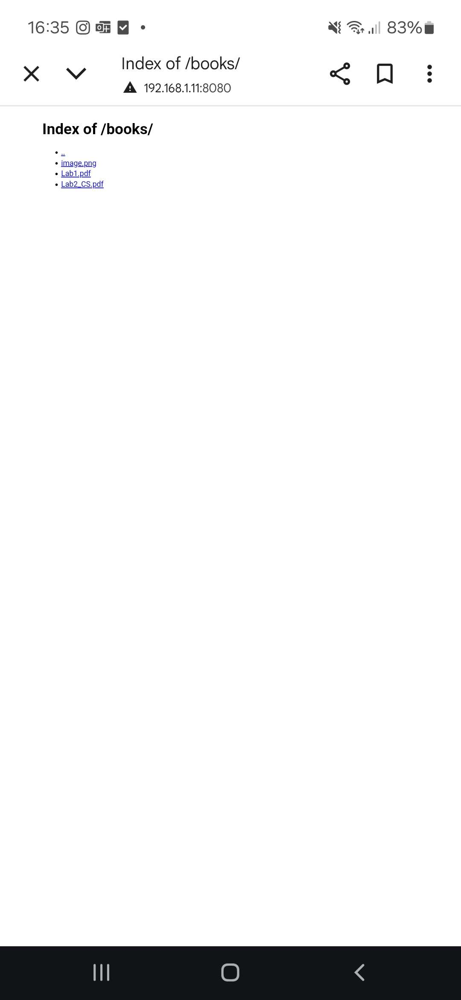
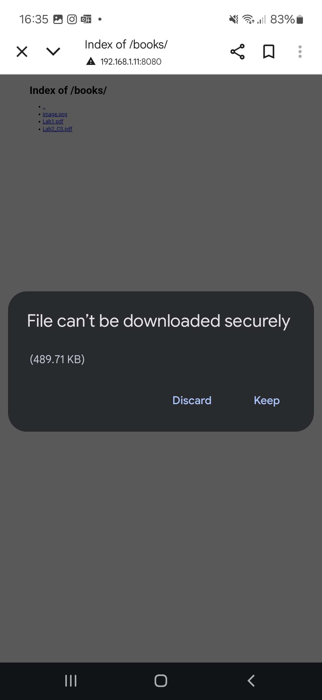

## Chirtoaca Liviu — Lab 1 Report: HTTP File Server 

This report documents a simple HTTP file server and client implemented with raw TCP sockets in Python. The project is containerized with Docker Compose so it can be run consistently anywhere.


### 1) Contents of source directory
```
project/
├── server.py
├── client.py
├── Dockerfile
├── docker-compose.yml
├── README.md
└── site/
    ├── index.html
    ├── image.png
    └── books/
        └── sample.pdf
```

### 2) Docker Compose file and Dockerfile
- Docker Compose: see `docker-compose.yml`
- Dockerfile: see `Dockerfile`

### 3) How to start the container
```bash
docker compose up --build server
```
Open `http://localhost:8080/` in the browser.

### 4) Command that runs the server inside the container (with directory argument)
The container command:
```bash
python server.py /app/site 8080
```

### 5) Contents of the served directory
Example (adjust to your files):
```
site/
├── index.html
├── image.png
└── books/
    └── sample.pdf
```

### 6) Requests of 4 files in the browser
- Inexistent file (404): `http://localhost:8080/nope.pdf`
  
  

- HTML file (with image): `http://localhost:8080/` (or `/index.html`)
  
  

- PDF file: `http://localhost:8080/books/sample.pdf`
  
  

- PNG file: `http://localhost:8080/image.png`
  
  

Tip: capture screenshots of each response page to include in your submission.

### 7) If you made the client — how to run, show output and saved files
Print HTML (root page):
```bash
docker compose run --rm client server 8080 / ./downloads
```
Save PNG:
```bash
docker compose run --rm client server 8080 /image.png ./downloads
```
Save PDF:
```bash
docker compose run --rm client server 8080 /books/sample.pdf ./downloads
```
After running the above, verify downloaded files in `downloads/` on the host.

### 8) If you made directory listing — page for a subdirectory
Request a folder without `index.html`, e.g.:
```
http://localhost:8080/books/
```
This shows the auto-generated directory listing with hyperlinks.



### 9) If you browsed a friend’s server — LAN setup and screenshots 
- Find your IP on the server machine (`ipconfig` → IPv4 Address)
- Friend visits `http://YOUR_IP:8080/` in the same LAN


Example screenshots:






### Conclusion
This project fulfills the lab requirements:

A raw TCP HTTP server serving HTML/PNG/PDF and generating directory listings
A client that prints HTML and saves PNG/PDF based on content type
Support for nested directories and safe path resolution
Fully Dockerized with a Compose workflow for reproducible runs
